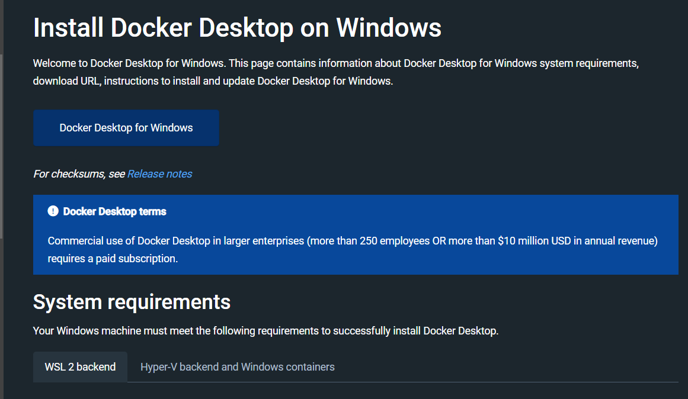
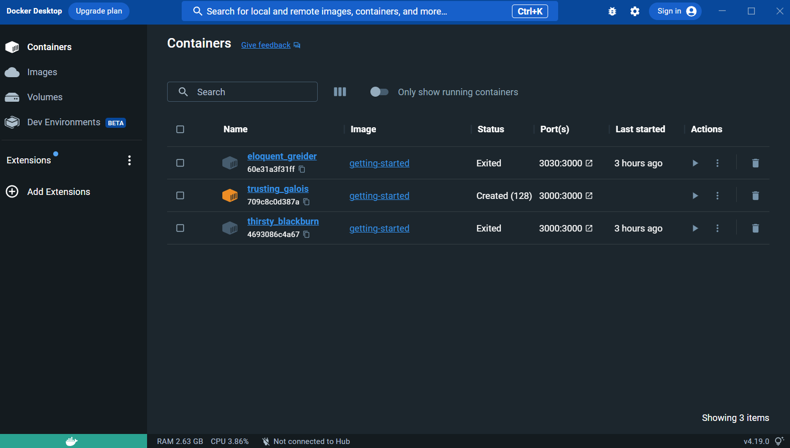
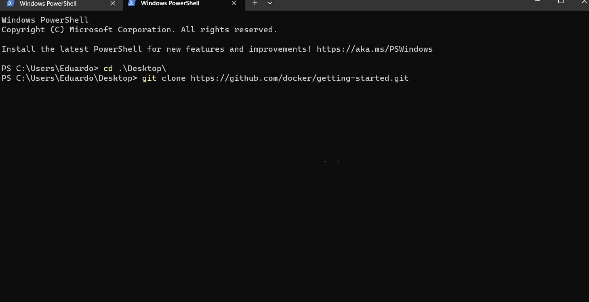
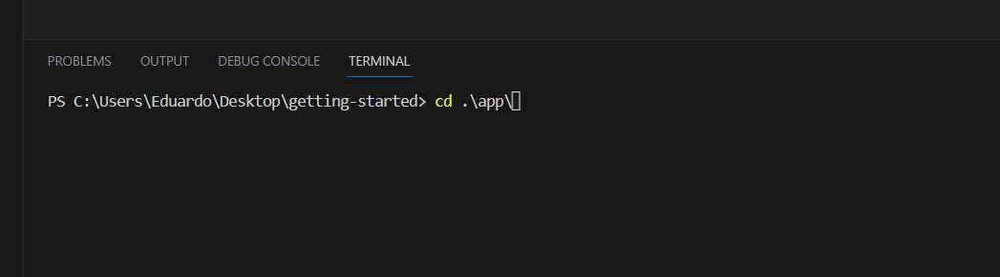
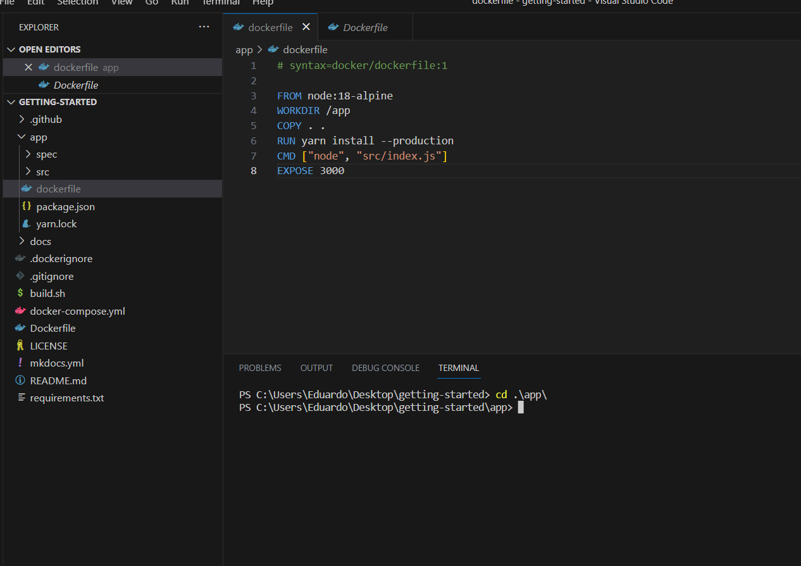
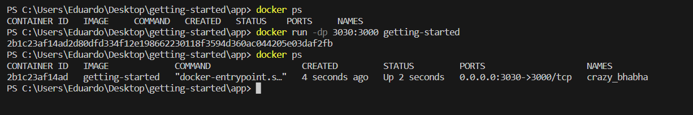
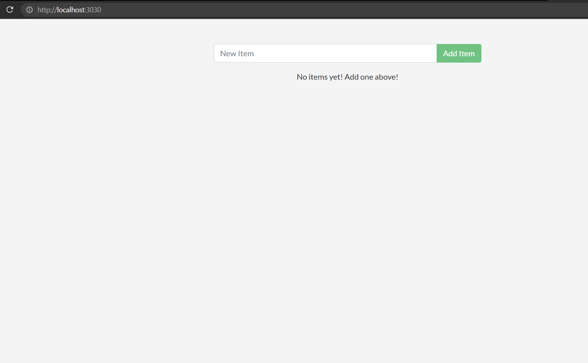

## Relatório do tutorial [docker get-started](https://docs.docker.com/get-started/02_our_app/) :

### Instalação do Docker (windows):
* Inicialmente precisei baixar e instalar o docker para versão do windows:
    * Na página do tutorial tinha um botão que levava a página de download e instalação do docker para várias versões de sistemas operacionais:
    
    * Terminado o dowload, cliquei 2x no instalador, fui clicando no "next" até ele começar a instalação propriamente dito, em seguida esperei a ela completar:
    
    * Depois de instalado abri o aplicativo:
    
* O primeiro passo do tutorial é clonar o repositório do [docker getting-started](https://github.com/docker/getting-started.git) usando o comando no terminal "git clone https://github.com/docker/getting-started.git":

* Em seguida entrei no repositório, e nele há um diretório chamado "app", entrei nele:

* Seguindo o tutorial, é pedido para criar um arquivo chamado "dockerfile", ele deve conter algumas configurações que serão usadas pela imagem que criaremos a seguir:

* Com o "dockerfile" pronto, o tutorial pede para usar o comando no terminal **"docker build -t getting-started ."**:

* Por fim, basta acessar pelo navegador o localhost usando a porta que foi configurada no momento da criação da imagem, para ver se a aplicação está realmente rodando:
